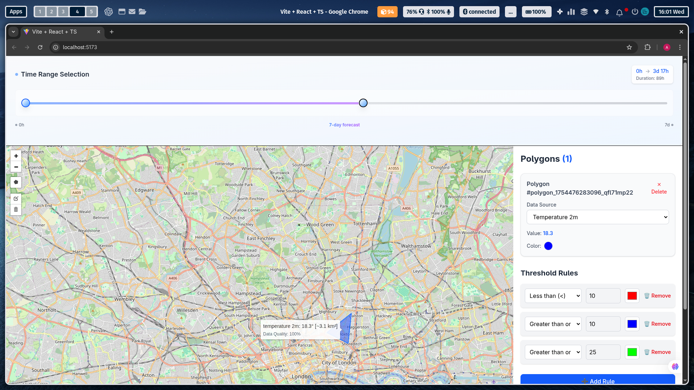

# mindWebs Weather Analysis App

A dynamic and interactive web application for visualizing and analyzing weather data on a map. This project showcases a modern frontend stack with a focus on user experience and data-driven interactions.

**Deployed URL:** [https://mindwebs-assignments-two.vercel.app/](https://mindwebs-assignments-two.vercel.app/)

---

## 📸 Screenshots

### Main Application Interface


_Interactive map with timeline slider and polygon sidebar for weather data analysis_

---

## 🚀 Setup and Run Instructions

To set up and run this project locally, follow these steps:

### Prerequisites

- [Node.js](https://nodejs.org/) (v18 or later)
- [npm](https://www.npmjs.com/) or [yarn](https://yarnpkg.com/)

### Installation

1.  **Clone the repository:**

    ```bash
    git clone https://github.com/Saikat123Dev/mindwebs-assignments.git
    cd mindwebs
    ```

2.  **Install dependencies:**
    ```bash
    npm install
    # or
    yarn install
    ```

### Running the Application

1.  **Start the development server:**

    ```bash
    npm run dev
    # or
    yarn dev
    ```

    The application will be available at `http://localhost:5173`.

2.  **Build for production:**

    ```bash
    npm run build
    # or
    yarn build
    ```

    The production-ready files will be in the `dist/` directory.

3.  **Lint the code:**
    ```bash
    npm run lint
    # or
    yarn lint
    ```

---

## 📚 Summary of Libraries Used

| Library           | Version  | Description                                                                                                   |
| ----------------- | -------- | ------------------------------------------------------------------------------------------------------------- |
| **React**         | `19.1.1` | A JavaScript library for building user interfaces, used for its component-based architecture and hooks.       |
| **Vite**          | `7.0.4`  | A fast and modern build tool that offers a seamless development experience with Hot Module Replacement (HMR). |
| **TailwindCSS**   | `4.1.11` | A utility-first CSS framework for rapid UI development and consistent styling.                                |
| **Leaflet**       | `1.9.4`  | An open-source JavaScript library for mobile-friendly interactive maps.                                       |
| **React-Leaflet** | `5.0.0`  | React components for Leaflet maps, providing seamless integration with the React ecosystem.                   |
| **Leaflet-Draw**  | `1.0.4`  | A plugin for Leaflet that adds support for drawing and editing vectors and markers on the map.                |

| **Lucide-React** | `0.536.0` | A library of simply beautiful and consistent icons. |
| **React Slider** | `2.0.6` | A customizable slider component for React, used for the timeline functionality. |

---

## 📝 Design and Development Remarks

### **Architecture**

- The application is built with a **component-based architecture**, where each part of the UI is a self-contained and reusable component (e.g., `ReactMap`, `TimelineSlider`, `PolygonSidebar`).
- **State Management**: React's built-in **Context API** is used for global state management. This choice is ideal for the application's scale, as it avoids the complexity of larger state management libraries like Redux while providing a centralized way to manage shared state (polygons, time range, etc.).

### **Styling**

- **TailwindCSS** was chosen for its utility-first approach, which allows for rapid and consistent styling directly within the JSX. This improves developer velocity and makes it easy to maintain a consistent design system.
- The `TimelineSlider` component features a sophisticated design with **gradient backgrounds, custom animations, and interactive tooltips**, all implemented using TailwindCSS utility classes. This demonstrates the power and flexibility of Tailwind for creating complex and beautiful UI elements without writing custom CSS.

### **Data Fetching and Handling**

- Asynchronous data fetching is handled by `fetch` , with robust error handling to ensure a smooth user experience.
- The `fetchWeather.ts` utility encapsulates the logic for fetching and processing weather data, including filtering data by time range and calculating averages. This separation of concerns makes the data fetching logic reusable and easy to test.

### **Map Interaction**

- **Leaflet** was chosen for its lightweight nature and extensive plugin ecosystem.
- `react-leaflet` provides a declarative API for using Leaflet within a React application.
- `leaflet-draw` allows users to draw polygons on the map, which then trigger data fetching and visualization for the selected area.

### **User Experience**

- The application is designed to be intuitive and user-friendly, with a focus on providing immediate visual feedback.
- Features like the animated timeline slider, interactive tooltips, and responsive design contribute to a polished and professional user experience.
